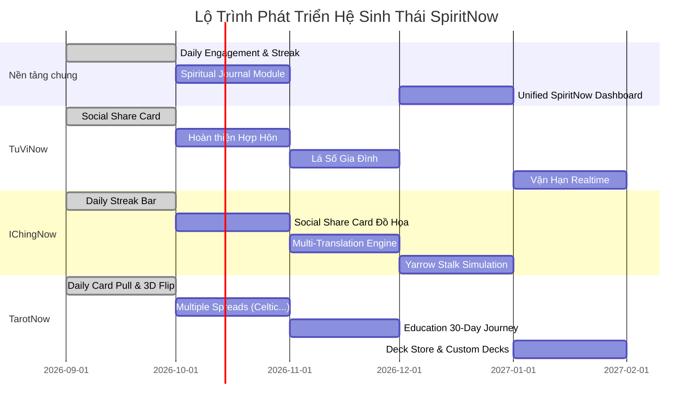

# 🔮 Kế Hoạch & Roadmap Phát Triển: TuViNow · IChingNow · TarotNow

> **Tài liệu chiến lược & lộ trình tính năng hệ sinh thái SpiritNow**  
> Cập nhật lần cuối: 01/10/2026

---

## 📌 Tiến Độ Hiện Tại (Progress Tracker)

| Tính Năng / Quick Win | Ứng Dụng | Trạng Thái | Chi Tiết Đã Triển Khai |
|:---|:---|:---:|:---|
| **Quick Win #1: Daily Card Pull + Streak** | TarotNow | ✅ **Đã xong** | Rút 1 lá free mỗi ngày (deterministic theo date), hiệu ứng 3D flip, insight & keywords, streak tracker + streak freeze |
| **Quick Win #2: Social Share Card + Image Export** | TuViNow | ✅ **Đã xong** | Thẻ chia sẻ mạng xã hội tóm tắt lá số, tích hợp Web Share API + xuất ảnh PNG 3x DPI + copy clipboard |
| **Quick Win #3: Daily Streak & Wisdom Bar** | IChingNow | ✅ **Đã xong** | Lời chúc theo giờ (Sáng/Chiều/Tối), hiển thị chuỗi ngày gieo quẻ, CTA 1-click "Gieo quẻ hôm nay", đếm streak tự động |
| **Shared Hook `useStreak`** | Cả 3 apps | ✅ **Đã xong** | Nằm tại `shared/src/utils/useStreak.js`, lưu `localStorage`, cơ chế bảo vệ chuỗi (Streak Freeze) |
| **Multiple Spread Layouts cho TarotNow** | TarotNow | ✅ **Đã xong** | Celtic Cross (10 lá), Horseshoe (7 lá), Relationship (7 lá), Career (5 lá), Yes/No — layout visualizer theo vị trí, SpreadSelector có category tabs |
| **Kết hợp Tử Vi + Kinh Dịch (Combined Reading)** | IChingNow + TuViNow | ✅ **Đã xong** | Shared module `CombinedReadingModal` — chọn chủ đề (sự nghiệp/tình duyên/tài lộc...), gieo quẻ 3 xu, AI tổng hợp cả hai nguồn. Tích hợp nút "🔮 Hỏi Kinh Dịch" ở TuViNow và "⭐ Kết hợp Tử Vi" ở IChingNow |
| **Quick Win #4: Social Share Card cho Kinh Dịch** | IChingNow | ⏳ **Kế tiếp** | Thẻ ảnh đồ họa Quẻ Chủ, Quẻ Biến, Lời Thoán để share FB/Zalo |
| **Quick Win #5: Tap-to-learn (Tra cứu nhanh)** | Cả 3 apps | ⏳ **Kế tiếp** | Chạm vào sao/lá bài/quẻ hiển thị popup giải nghĩa nhanh |
| **Hợp Hôn Chuyên Sâu (4 tiêu chí + AI)** | TuViNow | ⏳ **Đang chờ thuật toán** | Đã có `HOP_HON_PLAN.md`, cần nguồn thuật toán đầy đủ |
| **Spiritual Journal (Nhật ký tâm linh)** | Cả 3 apps | 📋 **Kế hoạch Q4/2026** | Ghi chép chiêm nghiệm sau mỗi lần xem, AI phân tích xu hướng |
| **Unified SpiritNow Dashboard** | Chung | 📋 **Kế hoạch Q1/2027** | Trang chủ chung gom cả 3 app, đăng nhập 1 lần (SSO) |

---

## 📊 Tổng Quan Hiện Trạng Hệ Thống

| App | Đã Có Sẵn | Hướng Phát Triển Tiếp Theo |
|:---|:---|:---|
| **TuViNow** | An lá số v11, AI luận giải qua SSO, lịch sử mã hóa, cân lượng/tiểu hạn/lưu niên, Social Share Card, Streak counter | Hợp hôn chuyên sâu, Lá số gia đình, Vận hạn real-time push, Phong thủy tích hợp |
| **IChingNow** | Gieo quẻ 3 xu (nhanh + từng hào), Mai Hoa Dịch Số, Lục Hào, AI luận giải, Daily Streak & Wisdom Bar, pricing | Social share card đồ họa, Mô phỏng cỏ thi (Yarrow stalk), Multi-translation engine, Bản đồ 64 quẻ |
| **TarotNow** | Rút bài 3D, AI giải bài, manual pick, Daily Card Pull + Streak, prompt export, pricing | Nhiều kiểu trải bài (Celtic Cross, Relationship...), Chế độ học Tarot 30 ngày, Thêm bộ bài mới (IAP) |

---

## 🧭 I. Chiến Lược Chung — Hệ Sinh Thái "SpiritNow"

### 1. 🌐 Unified "SpiritNow" Dashboard
Tạo một **trang chủ chung** kết nối cả 3 app, người dùng đăng nhập 1 lần (SSO đã có) và thấy:
- **Daily Insight**: Mỗi ngày nhận 1 quẻ IChing ngắn + 1 lá bài Tarot + nhận xét Tử Vi lưu niên.
- **Cross-reading (Tổng hợp 3 nguồn)**: "Hôm nay Tử Vi nói gì + IChing nói gì + Tarot nói gì" → AI tổng hợp đưa ra lời khuyên toàn diện.

### 2. 📓 Spiritual Journal (Nhật Ký Tâm Linh Toàn Hệ Thống)
Shared module cho cả 3 app:
- Sau mỗi reading, user viết **reflection note** ngắn.
- Hệ thống **tag & search** theo thời gian, chủ đề (sự nghiệp, tình cảm, sức khỏe...).
- **Pattern Tracking**: AI phân tích xu hướng readings qua thời gian (*"3 tháng qua bạn hay rút The Tower — có biến chuyển lớn nào đang diễn ra?"*).
- Xuất monthly / yearly reflection report.

### 3. 📱 Daily Engagement & Retention
- **Push Notification**: "Quẻ ngày hôm nay", "Lá bài hôm nay", "Sao chiếu hôm nay".
- **Streak System** với "Streak Freeze" (đã dựng nền tảng trong `useStreak.js`).
- **Lifetime Metrics**: "Bạn đã gieo 247 quẻ, rút 189 lá bài, lập 15 lá số".
- Widget trên màn hình chính (cho Android — đã có sẵn project `android/`).

---

## 🏮 II. TuViNow — Kế Hoạch Tính Năng

### ✅ Ưu Tiên Cao
1. **Hoàn thiện Hợp Hôn**:
   - Tham chiếu [HOP_HON_PLAN.md](file:///e:/Projects/IChingNow/tuvinow/HOP_HON_PLAN.md).
   - 4 tiêu chí chấm điểm + AI phân tích tương hợp + so sánh A/B.
2. **Lá Số Gia Đình**:
   - Quản lý lá số **nhiều thành viên gia đình** trong 1 tài khoản.
   - So sánh nhanh giữa các thành viên.
   - "Gia đình năm nay": tổng hợp vận hạn cả gia đình trong 1 giao diện.
3. **Vận Hạn Real-time & Lịch Cá Nhân**:
   - Chuyển tháng / đại hạn mới → thông báo sao chiếu & biến động cung.
   - Lịch vạn niên cá nhân hóa (ngày tốt/xấu theo chính bản mệnh người dùng).

### 🔄 Ưu Tiên Trung Bình
4. **Học Tử Vi Cùng AI**:
   - Tap vào bất kỳ sao / cung nào → hiển thị ý nghĩa, đắc hãm và ví dụ thực tế.
5. **Phong Thủy Cá Nhân Hóa**:
   - Dựa trên Bản Mệnh (Kim/Mộc/Thủy/Hỏa/Thổ) → gợi ý hướng nhà, bàn làm việc, màu sắc hợp mệnh.

---

## ☯️ III. IChingNow — Kế Hoạch Tính Năng

### ✅ Ưu Tiên Cao
1. **Social Share Card Đồ Họa Đẹp**:
   - Card đồ họa cho Quẻ Chủ & Quẻ Biến, hình vẽ hào quẻ cổ điển, lời Thoán từ và watermark IChingNow để chia sẻ lên MXH.
2. **Multi-Translation Engine (Đa Bản Dịch)**:
   - Cho phép người dùng chuyển đổi hoặc so sánh song song giữa:
     - Bản dịch tiếng Việt cổ điển (Ngô Tất Tố, Phan Bội Châu).
     - Bản dịch quốc tế chuẩn Wilhelm / Baynes.
     - Lời giải hiện đại của AI.
3. **Mô Phỏng Cỏ Thi (Yarrow Stalk Simulation)**:
   - Tái hiện phương thức gieo cỏ thi cổ xưa với phân phối xác suất chuẩn xác và giao diện thiền định (Mindful Casting).

### 🔄 Ưu Tiên Trung Bình
4. **Interactive Hexagram Map (Bản Đồ 64 Quẻ)**:
   - Bản đồ tương tác trực quan 64 quẻ Dịch.
   - Tra cứu quan hệ Hỗ quái, Thác quái, Bàng thông, Biến hào.
5. **Mai Hoa Dịch Số Pro**:
   - Nhận diện số tự động từ camera (biển số xe, số tài khoản).
   - Phân tích tương sinh tương khắc Ngũ Hành chuyên sâu.

---

## 🃏 IV. TarotNow — Kế Hoạch Tính Năng

### ✅ Ưu Tiên Cao
1. **Mở Rộng Các Kiểu Trải Bài (Multiple Spread Layouts)**:
   - Celtic Cross (10 lá).
   - Relationship / Tình yêu (7 lá).
   - Career / Sự nghiệp (5 lá).
   - Yes / No nhanh (1 lá).
   - Custom spread builder (người dùng tự tạo vị trí câu hỏi).
2. **Hành Trình Học Tarot (Learn Tarot in 30 Days)**:
   - Mỗi ngày học 1-2 lá với quiz tương tác.
   - Huy hiệu hoàn thành khóa học.

### 🔄 Ưu Tiên Trung Bình
3. **Nhiều Phong Cách Bộ Bài (Multiple Deck Styles)**:
   - Bộ bài Rider-Waite truyền thống.
   - Bộ bài phong cách thần thoại phương Đông / Việt Nam (AI generated).
   - Dark / Gothic theme, Minimalist line art.
4. **Cộng Đồng Giải Bài (Community Reading)**:
   - Ẩn danh đăng trải bài khó để cộng đồng hoặc AI hỗ trợ góc nhìn mới.

---

## 💰 V. Chiến Lược Monetization

### Mô Hình Freemium Đề Xuất

| Gói | Giá Tham Khảo | Quyền Lợi |
|:---|:---|:---|
| **Free** | 0đ | Daily Card pull, gieo quẻ cơ bản, 1 lượt AI reading mỗi tuần |
| **Plus** | ~79k/tháng | Không giới hạn AI reading, Spiritual Journal, xuất ảnh HD |
| **Pro** | ~149k/tháng | Mở khóa toàn bộ 3 app, tính năng gia đình, ưu tiên AI tốc độ cao |
| **Lifetime** | ~999k (trọn đời) | Quyền lợi Pro vĩnh viễn |

### Doanh Thu Bổ Sung:
- **Digital Deck Store**: Bán các bộ bài Tarot nghệ thuật độc quyền.
- **Báo Cáo Tử Vi Vận Hạn Năm Mới (Tết)**: Báo cáo PDF cao cấp in ấn được.
- **Marketplace Chuyên Gia**: Kết nối người dùng xem trực tiếp với chuyên gia phong thủy / chiêm tinh uy tín.

---

## 🚀 VI. Timeline Triển Khai Gợi Ý

---

> [!NOTE]
> Khi cần tiếp tục phát triển bất kỳ tính năng nào, chỉ cần yêu cầu tên tính năng trong bảng **Tiến Độ Hiện Tại** hoặc theo các mục I → V ở trên!
